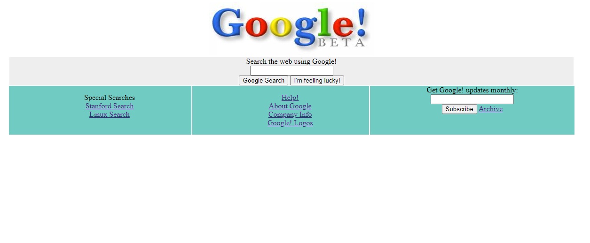
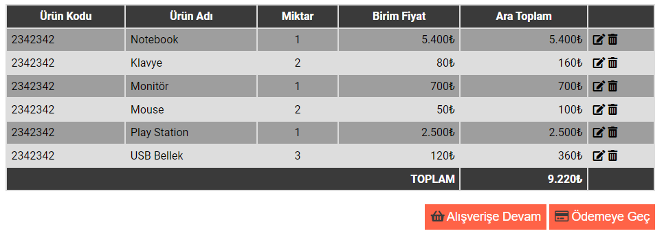
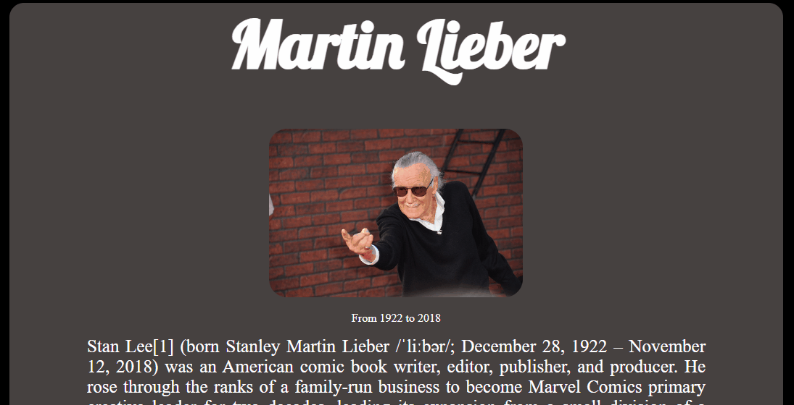
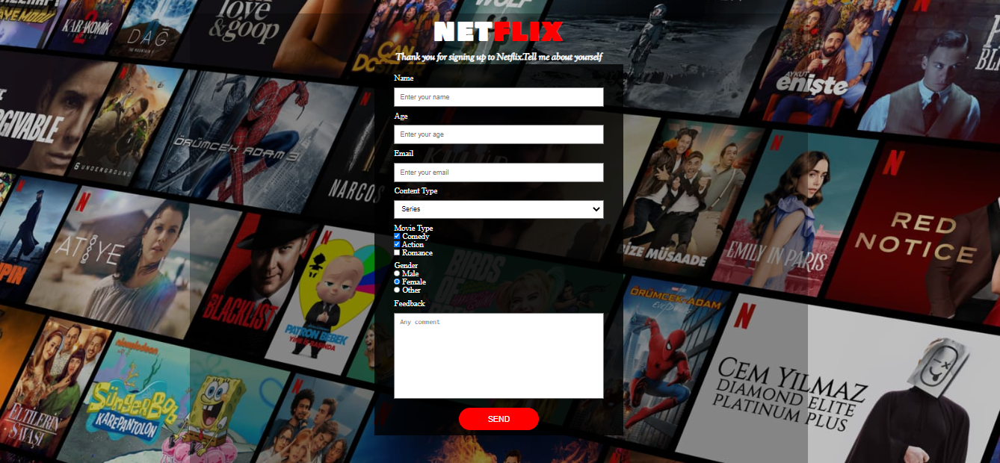

# HTML_CSS_Projects
HTML CSS Projects

<table class="table">
  <caption>HMTL-CSS PROJECTS<caption>
  <thead>
    <tr>
      <th width="10%">S.Nu</td>
      <th align="left" width="15%">Project Name</th>
      <th align="left" width="15%">Repo Link</th>
      <th align="left" width="15%">App Link</th>
      <th align="center">Overview</th>
    </tr>
  </thead>
  <tbody>
    <tr>
      <td align=center >1.</td>
      <td>Google 1998</td>
      <td><a href="https://github.com/Tolga-Han-Yilmaz/google_1998" target="_blank">Repo Details</td>
      <td><a href="https://tolga-han-yilmaz.github.io/google_1998/" target="_blank">App Details</td>
      <td></td>
    </tr>
    <tr>
      <td align=center >2.</td>
      <td>Shopping List</td>
      <td><a href="https://github.com/Tolga-Han-Yilmaz/Alis-veris-Project" target="_blank">Repo Details</td>
      <td><a href="https://tolga-han-yilmaz.github.io/Alis-veris-Project/" target="_blank">App Details</td>
      <td></td>
    </tr>
    <tr>
      <td align=center >3.</td>
      <td>Life of Martin Lieber</td>
      <td><a href="https://github.com/Tolga-Han-Yilmaz/Martin-Lieber" target="_blank">Repo Details</td>
      <td><a href="https://tolga-han-yilmaz.github.io/Martin-Lieber/" target="_blank">App Details</td>
      <td></td>
    </tr>
     <tr>
      <td align=center >4.</td>
      <td>Netflix Frontend</td>
      <td><a href="https://github.com/Tolga-Han-Yilmaz/Survey-From-Project" target="_blank">Repo Details</td>
      <td><a href="https://tolga-han-yilmaz.github.io/Survey-From-Project/" target="_blank">App Details</td>
      <td></td>
    </tr>
   </tbody>
</table>