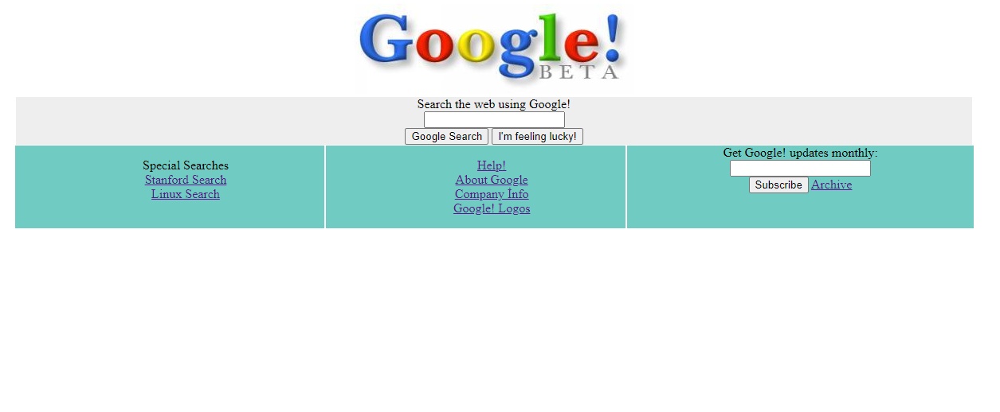
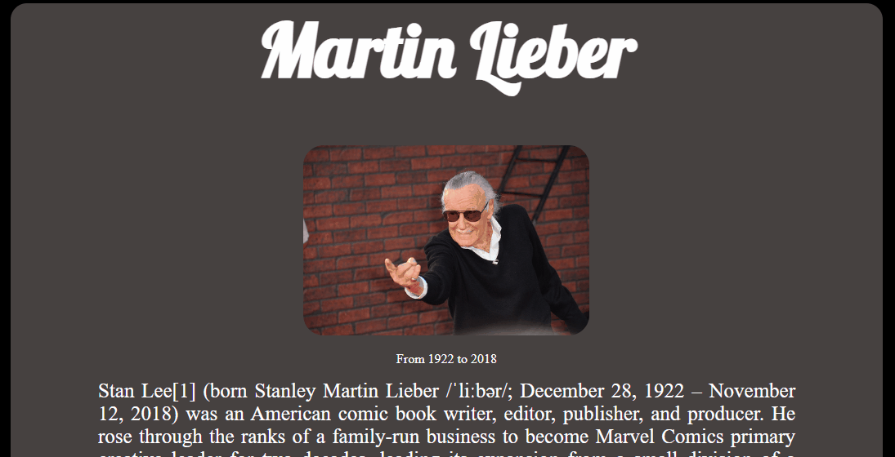
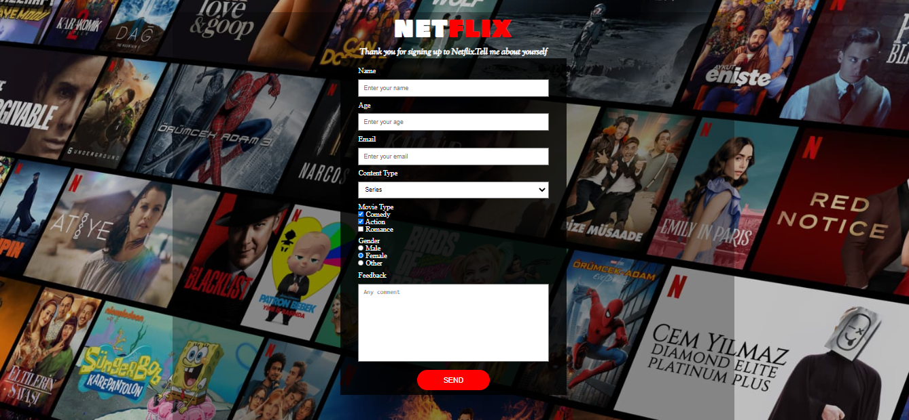
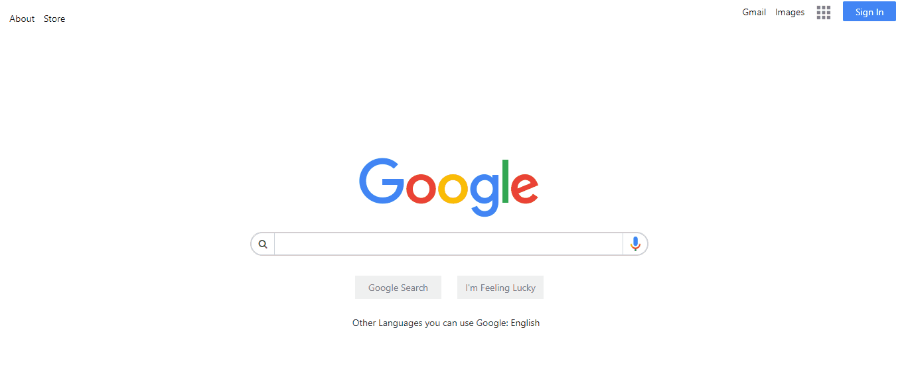
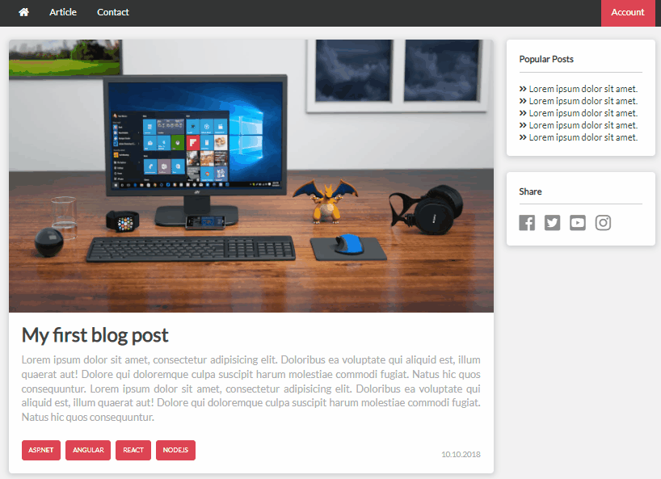
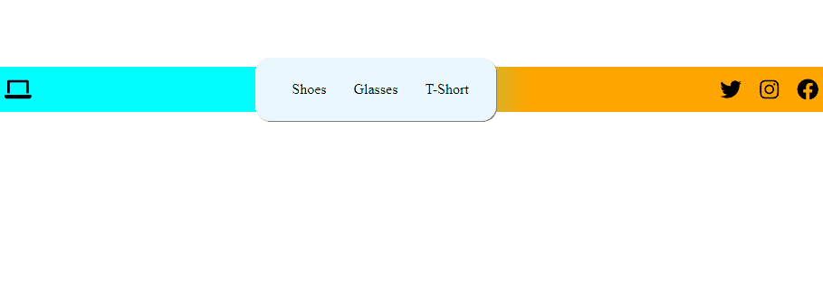
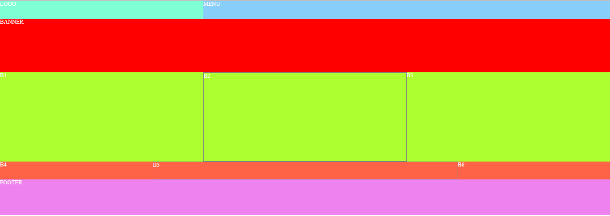
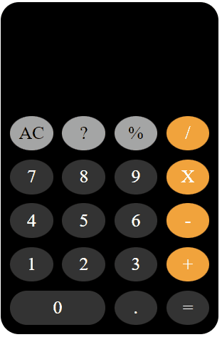
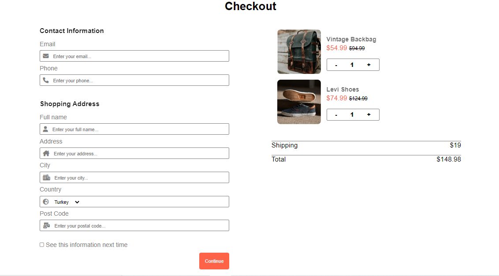
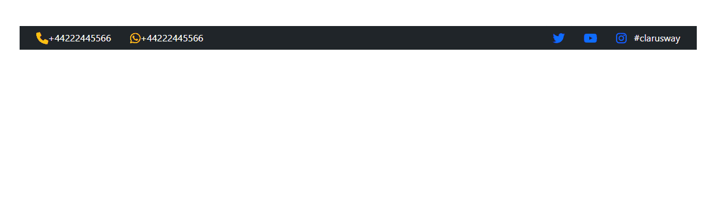

# HTML_CSS_Projects
HTML CSS Projects

<table class="table">
  <caption>HMTL-CSS PROJECTS<caption>
  <thead>
    <tr>
      <th width="10%">S.Nu</td>
      <th align="left" width="15%">Project Name</th>
      <th align="left" width="15%">Repo Link</th>
      <th align="left" width="15%">App Link</th>
      <th align="center">Overview</th>
    </tr>
  </thead>
  <tbody>
     <tr>
      <td align=center >1.</td>
      <td>Google 1998</td>
      <td><a href="https://github.com/Tolga-Han-Yilmaz/google_1998" target="_blank">Repo Details</td>
      <td><a href="https://tolga-han-yilmaz.github.io/google_1998/" target="_blank">App Details</td>
      <td></td>
    </tr>
    <tr>
      <td align=center >2.</td>
      <td>Shopping List</td>
      <td><a href="https://github.com/Tolga-Han-Yilmaz/Alis-veris-Project" target="_blank">Repo Details</td>
      <td><a href="https://tolga-han-yilmaz.github.io/Alis-veris-Project/" target="_blank">App Details</td>
      <td></td>
    </tr>
    <tr>
      <td align=center >3.</td>
      <td>Life of Martin Lieber</td>
      <td><a href="https://github.com/Tolga-Han-Yilmaz/Martin-Lieber" target="_blank">Repo Details</td>
      <td><a href="https://tolga-han-yilmaz.github.io/Martin-Lieber/" target="_blank">App Details</td>
      <td></td>
    </tr>
    <tr>
      <td align=center >4.</td>
      <td>Netflix Frontend</td>
      <td><a href="https://github.com/Tolga-Han-Yilmaz/Survey-From-Project" target="_blank">Repo Details</td>
      <td><a href="https://tolga-han-yilmaz.github.io/Survey-From-Project/" target="_blank">App Details</td>
      <td></td>
    </tr>
    <tr>
      <td align=center >5.</td>
      <td>Google Page</td>
      <td><a href="https://github.com/Tolga-Han-Yilmaz/google-landing-project" target="_blank">Repo Details</td>
      <td><a href="https://tolga-han-yilmaz.github.io/google-landing-project/" target="_blank">App Details</td>
      <td></td>
    </tr>
    <tr>
      <td align=center >6.</td>
      <td>Left Drop Down Menu</td>
      <td><a href="https://github.com/Tolga-Han-Yilmaz/sol-acilir-menu" target="_blank">Repo Details</td>
      <td><a href="https://tolga-han-yilmaz.github.io/sol-acilir-menu/" target="_blank">App Details</td>
      <td></td>
    </tr>
    <tr>
      <td align=center >7.</td>
      <td>Parallax Website</td>
      <td><a href="https://github.com/Tolga-Han-Yilmaz/ParallaxWebsite" target="_blank">Repo Details</td>
      <td><a href="https://tolga-han-yilmaz.github.io/ParallaxWebsite/" target="_blank">App Details</td>
      <td></td>
    </tr>
    <tr>
      <td align=center >8.</td>
      <td>Sample Blog Page</td>
      <td><a href="https://github.com/Tolga-Han-Yilmaz/blog-project" target="_blank">Repo Details</td>
      <td><a href="https://tolga-han-yilmaz.github.io/blog-project/" target="_blank">App Details</td>
      <td></td>
    </tr>
    <tr>
      <td align=center >9.</td>
      <td>Flex Navbar</td>
      <td><a href="https://github.com/Tolga-Han-Yilmaz/flex-navbar" target="_blank">Repo Details</td>
      <td><a href="https://tolga-han-yilmaz.github.io/flex-navbar/" target="_blank">App Details</td>
      <td></td>
    </tr>
    <tr>
      <td align=center >10.</td>
      <td>Flex Grid</td>
      <td><a href="https://github.com/Tolga-Han-Yilmaz/flex-grid" target="_blank">Repo Details</td>
      <td><a href="https://tolga-han-yilmaz.github.io/flex-grid/" target="_blank">App Details</td>
      <td></td>
    </tr>
    <tr>
      <td align=center >11.</td>
      <td>İOS Calculator</td>
      <td><a href="https://github.com/Tolga-Han-Yilmaz/IOS_Calculator" target="_blank">Repo Details</td>
      <td><a href="https://tolga-han-yilmaz.github.io/IOS_Calculator/" target="_blank">App Details</td>
      <td></td>
    </tr>
    <tr>
      <td align=center >12.</td>
      <td>Checkout Form</td>
      <td><a href="https://github.com/Tolga-Han-Yilmaz/checkout-form" target="_blank">Repo Details</td>
      <td><a href="https://tolga-han-yilmaz.github.io/checkout-form/" target="_blank">App Details</td>
      <td></td>
    </tr>
        <tr>
      <td align=center >13.</td>
      <td>Bootstrap Navbar</td>
      <td><a href="https://github.com/Tolga-Han-Yilmaz/bootstrap_navbar" target="_blank">Repo Details</td>
      <td><a href="https://tolga-han-yilmaz.github.io/bootstrap_navbar/" target="_blank">App Details</td>
      <td></td>
    </tr>
    <tr>
      <td align=center >14.</td>
      <td>Responsive Design</td>
      <td><a href="https://github.com/Tolga-Han-Yilmaz/responsive_design" target="_blank">Repo Details</td>
      <td><a href="https://tolga-han-yilmaz.github.io/responsive_design/" target="_blank">App Details</td>
      <td></td>
    </tr>
    <tr>
      <td align=center >15.</td>
      <td>SASS Website</td>
      <td><a href="https://github.com/Tolga-Han-Yilmaz/SASS_Website" target="_blank">Repo Details</td>
      <td><a href="https://tolga-han-yilmaz.github.io/SASS_Website/" target="_blank">App Details</td>
      <td></td>
    </tr>
   </tbody>
</table>